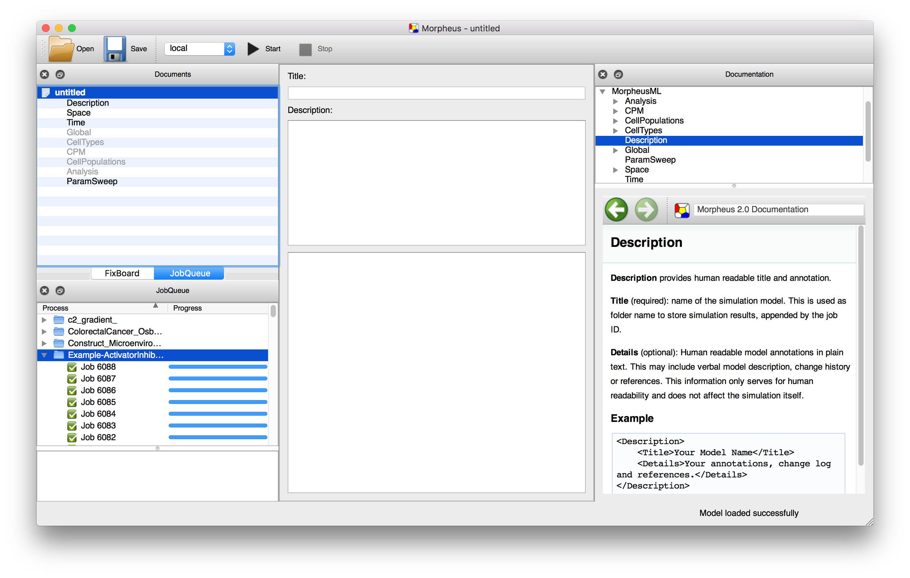
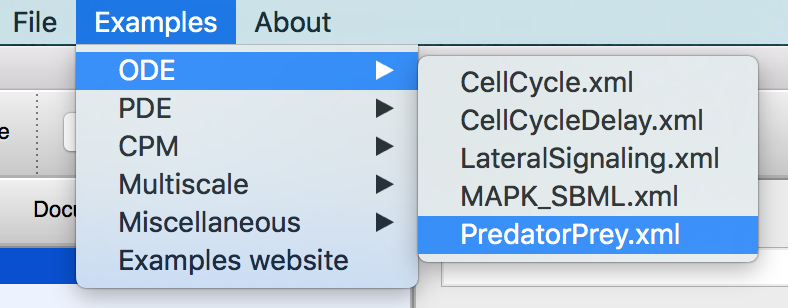
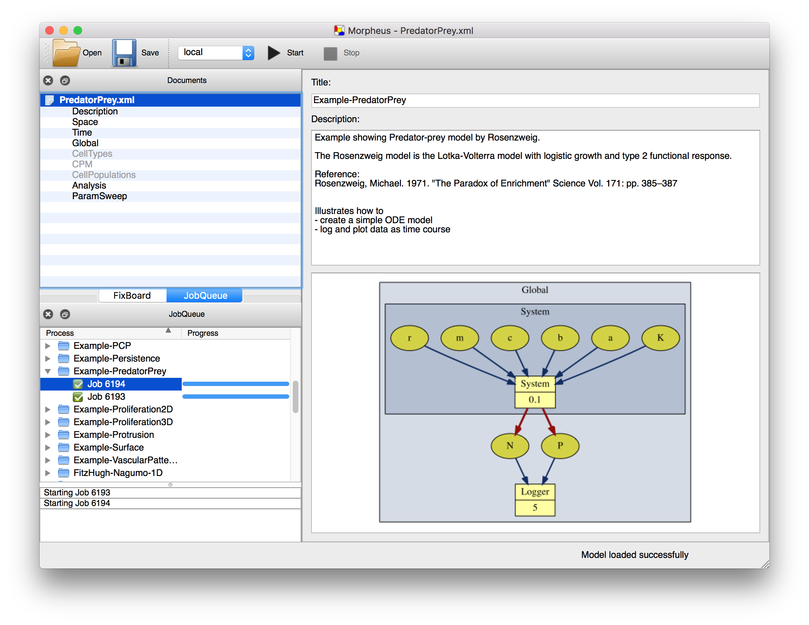
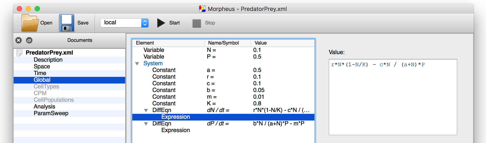
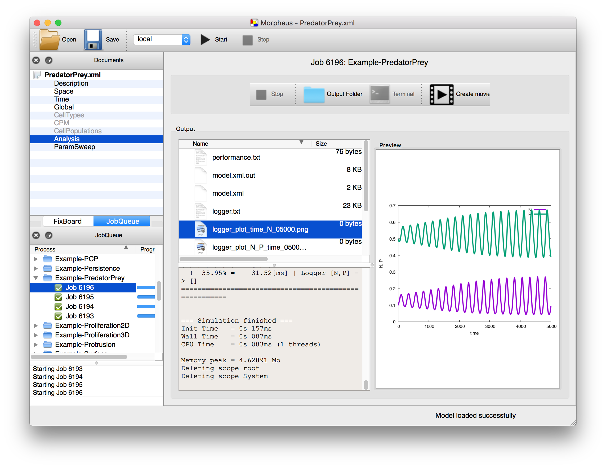

#Morpheus tutorial
-----------------

## Introduction

In this tutorial, we'll have a first look at Morpheus and how to construct your first models. 

I will assume you have Morpheus (v1.9.2+) installed, together with Gnuplot which is used for plotting. Note that I will use v1.9.4 in this tutorial and things may look a little different.

## Quick start 

If you start Morpheus, you will be faced with an interface like this:




- In the top left, you see the **Documents** panel where you can browse through sections of a model. And, if you have multiple models opened at once, you can browse between different models. 
  - The black sections are already filled in, the model sections that are greyed out can be added or activated by a double-click.

- In the bottom left, you see the **JobQueue** panel where you can browse through your simulation results.
  - When starting a new simulation, a job will be added to the queue and executed when resources are available.

- In the middle, is the **Editor** panel where most of the modeling will happen. More on that later.

- To the right, we see the **Documentation** panel here you can browse the docs.
  - The documentation panel is context-sensitive. When you select a part of a model, the relevant documentation will appear automatically. 


### Open an example model

Morpheus has a number of example models to help get you started. From the menu bar, just select Examples and select one, e.g. `ODE / PredatorPrey`.



#### Front page

Afterwards, you'll see a kind-of front page with a

- **Title**: Descriptive name, also used as a folder name to store simulation results.

- **Description**: Model description containing e.g. functionalities, change log, notes, references. Only for human readability.

- **Symbol graph**: A graphical sketch of the model structure showing how symbols depend on ecah other. 



#### Dependency graph
 
In the example above, it shows that there is a `System` (or ordinary differential equations) that takes a number of symbols (`r`, `m`, `c`) as inputs and writes to symbols `N` and `P`. These are subsequently used by a `Logger`. We can also see the `System` is updated every 0.1 time steps and the `Logger` only every 5 time steps.

### Browsing the model 

You can browse the model in the **Documents** panel. Selecting e.g. the `Global` section, it will show up in the **Editor** and show the `Constants` and `DiffEqns` (differential equations) that make up the `System`. 

You can chang values and expressions by selecting a constant of equation in the editor and alter them in the **Attribute** editor in the top right.



#### Running the model

To run the model, simply push the **Start** button or press **F8**. The model is now added to the **JobQueue**. 



#### Viewing results

To see simulation results, select the job. This open a **file browser** opens in the middle panel.

In the file browser, you can preview files:

- To view plots, select an **image file** (`*.png`, `*.jpg`) to open it in the right panel.

- To view log files, select a **text file** (`*.txt`, `*.xml`) to preview it in the right panel (max. `10Mb`).

The center bottom panel shows the **standard output** of the model. At the end of simulation, it shows information on **execution time** (wall time and cpu time) and **memory usage**.

#### Check out other models

Morpheus has a number of built-in models that show different features. Have a look around!

```
├── CPM
│   ├── CellSorting_2D.xml
│   ├── CellSorting_2D2.xml
│   ├── CellSorting_3D.xml
│   ├── ConvergenceExtension.xml
│   ├── ConvergentExtension.xml
│   ├── Crypt.xml
│   ├── Persistence_2D.xml
│   ├── PigmentCells.xml
│   ├── Proliferation_2D.xml
│   ├── Proliferation_3D.xml
│   ├── Protrusion.xml
│   ├── Protrusion_2D.xml
│   ├── Protrusion_3D.xml
│   ├── RunAndTumble.xml
│   └── crypt.tif
├── Miscellaneous
│   ├── FrenchFlag.xml
│   ├── GameOfLife.xml
│   ├── GameOfLife_Field.xml
│   ├── ParticleAggregation.xml
│   └── ShellCA.xml
├── Multiscale
│   ├── AutocrineChemotaxis.xml
│   ├── CellCycle.xml
│   ├── CellCycle_3D.xml
│   ├── CellCycle_PDE.xml
│   ├── CellPolarity.xml
│   ├── CellPolarity_3D.xml
│   ├── Dictyostelium.xml
│   ├── MultiscaleModel.xml
│   ├── PCP.xml
│   ├── PlanarCellPolarity.xml
│   └── VascularPatterning.xml
├── ODE
│   ├── CellCycle.xml
│   ├── CellCycleDelay.xml
│   ├── CellCycle_Global.xml
│   ├── DeltaNotch.xml
│   ├── LateralSignaling.xml
│   ├── MAPK_SBML.xml
│   └── PredatorPrey.xml
└── PDE
    ├── ActivatorInhibitor_1D.xml
    ├── ActivatorInhibitor_2D.xml
    ├── ActivatorInhibitor_Domain.xml
    ├── ExcitableMedium_3D.xml
    ├── TuringPatterns.xml
    └── domain.tif
```


## My first model

Running examples are nice, constructing a model from scratch is something completely different! 

Here, we will go through the common steps and traps when building a new model.

### Basic model structure


#### `Space`
#### `Time`
#### `Global`
#### `Analysis`

...


## Cell-based models

### Fixed cells

### Cellular Potts model


## ODE model

### Without cells 

### Within cells 


## PDE models

### Reaction diffusion

### Reaction diffusion coupled to cells