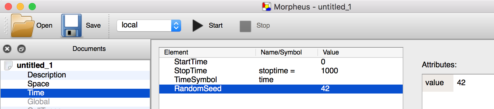

Morpheus tutorial
-----------------

## Table of contents

- [Introduction](#Introduction)
- [Quick start](#Quick-start)
- [My first model](#My-first-model)
-

## Introduction

In this tutorial, we'll have a first look at Morpheus and how to construct your first models. 

I will assume you have Morpheus (v1.9.2+) installed, together with Gnuplot which is used for plotting. Note that I will use v1.9.4 in this tutorial and things may look a little different.

## Quick start 

If you start Morpheus, you will be faced with an interface like this:


- In the top left, you see the **Documents** panel where you can browse through sections of a model. And, if you have multiple models opened at once, you can browse between different models. 
  - The black sections are already filled in, the model sections that are greyed out can be added or activated by a double-click.

- In the bottom left, you see the **JobQueue** panel where you can browse through your simulation results.
  - When starting a new simulation, a job will be added to the queue and executed when resources are available.

- In the middle, is the **Editor** panel where most of the modeling will happen. More on that later.

- To the right, we see the **Documentation** panel here you can browse the docs.
  - The documentation panel is context-sensitive. When you select a part of a model, the relevant documentation will appear automatically. 


### Open an example model

Morpheus has a number of example models to help get you started. From the menu bar, just select Examples and select one, e.g. `ODE / PredatorPrey`.


#### Front page

Afterwards, you'll see a kind-of front page with a

- **Title**: Descriptive name, also used as a folder name to store simulation results.

- **Description**: Model description containing e.g. functionalities, change log, notes, references. Only for human readability.

- **Symbol graph**: A graphical sketch of the model structure showing how symbols depend on ecah other. 


#### Dependency graph
 
In the example above, it shows that there is a `System` (or ordinary differential equations) that takes a number of symbols (`r`, `m`, `c`) as inputs and writes to symbols `N` and `P`. These are subsequently used by a `Logger`. We can also see the `System` is updated every 0.1 time steps and the `Logger` only every 5 time steps.

### Browsing the model 

You can browse the model in the **Documents** panel. Selecting e.g. the `Global` section, it will show up in the **Editor** and show the `Constants` and `DiffEqns` (differential equations) that make up the `System`. 

You can chang values and expressions by selecting a constant of equation in the editor and alter them in the **Attribute** editor in the top right.


#### Running the model

To run the model, simply push the **Start** button or press **F8**. The model is now added to the **JobQueue**. 


#### Viewing results

To see simulation results, select the job. This open a **file browser** opens in the middle panel.

In the file browser, you can preview files:

- To view plots, select an **image file** (`*.png`, `*.jpg`) to open it in the right panel.

- To view log files, select a **text file** (`*.txt`, `*.xml`) to preview it in the right panel (max. `10Mb`).

The center bottom panel shows the **standard output** of the model. At the end of simulation, it shows information on **execution time** (wall time and cpu time) and **memory usage**.

#### Check out other models

Morpheus has a number of built-in models that show different features. Have a look around!

```
├── CPM
│   ├── CellSorting_2D.xml
│   ├── CellSorting_2D2.xml
│   ├── CellSorting_3D.xml
│   ├── ConvergenceExtension.xml
│   ├── ConvergentExtension.xml
│   ├── Crypt.xml
│   ├── Persistence_2D.xml
│   ├── PigmentCells.xml
│   ├── Proliferation_2D.xml
│   ├── Proliferation_3D.xml
│   ├── Protrusion.xml
│   ├── Protrusion_2D.xml
│   ├── Protrusion_3D.xml
│   ├── RunAndTumble.xml
│   └── crypt.tif
├── Miscellaneous
│   ├── FrenchFlag.xml
│   ├── GameOfLife.xml
│   ├── GameOfLife_Field.xml
│   ├── ParticleAggregation.xml
│   └── ShellCA.xml
├── Multiscale
│   ├── AutocrineChemotaxis.xml
│   ├── CellCycle.xml
│   ├── CellCycle_3D.xml
│   ├── CellCycle_PDE.xml
│   ├── CellPolarity.xml
│   ├── CellPolarity_3D.xml
│   ├── Dictyostelium.xml
│   ├── MultiscaleModel.xml
│   ├── PCP.xml
│   ├── PlanarCellPolarity.xml
│   └── VascularPatterning.xml
├── ODE
│   ├── CellCycle.xml
│   ├── CellCycleDelay.xml
│   ├── CellCycle_Global.xml
│   ├── DeltaNotch.xml
│   ├── LateralSignaling.xml
│   ├── MAPK_SBML.xml
│   └── PredatorPrey.xml
└── PDE
    ├── ActivatorInhibitor_1D.xml
    ├── ActivatorInhibitor_2D.xml
    ├── ActivatorInhibitor_Domain.xml
    ├── ExcitableMedium_3D.xml
    ├── TuringPatterns.xml
    └── domain.tif
```


## My first model

Running examples are nice, constructing a model from scratch is something completely different! 

Here, we will go through the common steps and traps when building a new model.


### Basic model structure

To start a new model, `File -> New` in the menu. A model opens in the Document panel.

Each model needs to specify some parts. This includes the `Description` section that we saw above and the sections `Space` and `Time`. For most simulations, we will also need a `Global` section to define some variables and a `Analysis` section to generate output. Let's have a look at these sections. 

Required sections are highlighted in black, optional sections are greyed out and can be added by double-click.
{: .alert .alert-gitlab-orange}

#### `Space`

In the `Space` section, you define the size and structure of the lattice (discretized space) as well as e.g. the boundary conditions.

For instance, to construct a simulation in a 2D square space of size 100 x 100: 


Optionally, you can `BoundaryConditions` or read a `Domain` from file by selecting (double-click) one of the optional plugins that appear in the bottom-right panel:


By default, periodic boundaries are used.  

#### `Time`

In the `Time` section, you specify the duration of a simulation in terms of simulation steps. You can also specify a symbol to refer to the current time (by default, this is `time`).

Here, a simulation is specified to run from for a `1000` steps:
  


Optionally, you can choose a `RandomSeed` to make a simulation exactly reproducible. By default, a different seed is used in each simulation run. 


#### `Global`

In the `Global` scope, you can start doing some real modeling! 


The name `"Global"` comes from the fact that Morpheus uses [scoping](https://en.wikipedia.org/wiki/Scope_(computer_science)). As in almost all programming languages, variables are only valid for the scope which they are defined. In Morpheus, each symbol is only accessible within its own scope. For example, a symbol attached to one cell type is only valid for points in space that are occupied by those cells and not anywhere else. Scoping is a pretty powerful concept but more on that later. 
{: .alert .alert-gitlab-orange}


In `Global` you can declare `Constants`, `Variables` and `Fields` that are valid throughout the simulation. 

Here we specify 3 `Variables` and change their values using a `System` of `DiffEqn` (taken from `Examples/CellCycle_Global.xml`): 


Note that we can choose a `solver` and `time-step` for the `System`. Here, we also specify an option `time-scaling` to scale the time of the ODE system to the simulation time, making it 50x slower.

#### `Analysis`

Finally, we want the simulation to give us some output.

The section `Analysis` is used for data export and plotting. It hosts a large number of tools to track and visualize cells and their properties, their motility, cell-cell contacts, etc. 

The `Logger` and `Gnuplotter` are probably the most relevant for common purposes. 

Here, I specify a `Logger` to periodically write the values of our 3 symbols (APC, CDK1 and Plk1) to a CSV file.  Additionally, we define a `Plot` in which the values of these symbols are plotted against `time`.


This will produce a tab-delimited text file called `logger.txt`:

```bash
"time"	"APC"	"CDK1"	"Plk1"
0	0	0	0
1	2.94419e-174	0.002	4.608e-22
2	2.10491e-150	0.004	2.23705e-19
3	2.3242e-137	0.006	8.55537e-18
4	3.03672e-128	0.008	1.13653e-16
5	3.33834e-121	0.01	8.4497e-16
6	1.87021e-115	0.012	4.35098e-15
7	1.35985e-110	0.014	1.73875e-14
8	2.22359e-106	0.016	5.77169e-14
9	1.16268e-102	0.018	1.66271e-13
10	2.47079e-99	0.02	4.28328e-
```

**and** an image file called `logger_plot_time_APC_01000.png`:


## Cell-based models

Now you'll want to see cells in action. Don't worry, you will.


### Fixed cells

### Cellular Potts model


## ODE model

### Without cells 

### Within cells 


## PDE models

### Reaction diffusion

### Reaction diffusion coupled to cells